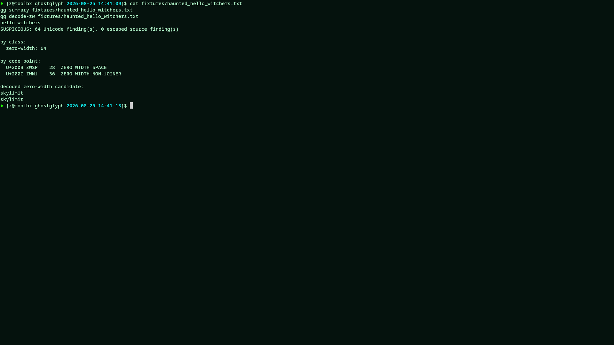
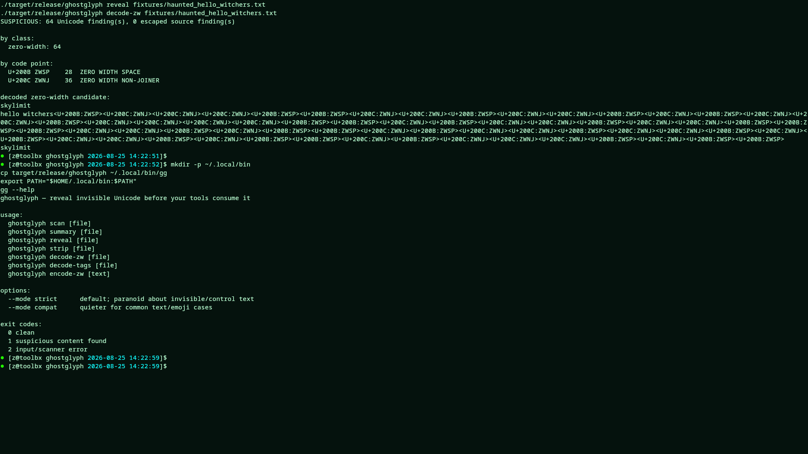

# Ghostglyph

Reveal invisible Unicode before your tools consume it.

Ghostglyph is a tiny no-dependency Rust CLI for detecting, revealing, stripping and decoding suspicious invisible Unicode in text streams.

Built for:

- LLM prompts
- MCP/tool descriptions
- pasted code
- shell pipelines
- config files
- clipboard hygiene

Linux ELF first. Windows can use WSL for now.

## Quick build

Run from the repo root:

    cargo test
    cargo build --release

Use the local binary:

    ./target/release/ghostglyph summary fixtures/haunted_hello_witchers.txt

Optional local install as `gg`:

    mkdir -p ~/.local/bin
    cp target/release/ghostglyph ~/.local/bin/gg
    export PATH="$HOME/.local/bin:$PATH"
    gg --help

## Tiny demo

Visible text:

    hello witchers

Hidden zero-width payload:

    skylimit

Run:

    gg summary fixtures/haunted_hello_witchers.txt
    gg reveal fixtures/haunted_hello_witchers.txt
    gg decode-zw fixtures/haunted_hello_witchers.txt
    gg decode-zw-hex fixtures/haunted_binary_ff.txt

Expected summary shape:

    SUSPICIOUS: 64 Unicode finding(s), 0 escaped source finding(s)

    by class:
      zero-width: 64

    by code point:
      U+200B ZWSP    28  ZERO WIDTH SPACE
      U+200C ZWNJ    36  ZERO WIDTH NON-JOINER

    decoded zero-width candidate:
    skylimit

## Commands

    scan          detailed findings, one line per character
    summary       compact screenshot-friendly report
    reveal        print visible markers such as <U+200B:ZWSP>
    strip         remove suspicious characters
    decode-zw     decode U+200B/U+200C binary payloads as text, with hex fallback
    decode-zw-hex decode U+200B/U+200C binary payloads as 0x-prefixed bytes
    decode-tags   decode Unicode Tags printable ASCII payloads
    encode-zw     helper: encode text using U+200B=0 and U+200C=1

Exit codes:

    0 clean
    1 suspicious content found
    2 scanner/input error

Modes:

    --mode strict    default; paranoid about invisible/control text
    --mode compat    quieter for common text/emoji cases

## Binary / encrypted payload fallback

If a zero-width payload does not decode as printable UTF-8, Ghostglyph still reports the bytes.

Example:

    gg summary fixtures/haunted_binary_ff.txt
    gg decode-zw-hex fixtures/haunted_binary_ff.txt

Expected shape:

    decoded zero-width candidate:
    utf8: <invalid or non-printable>
    hex: 0xFF 0x00 0x41
    bytes: 3

This is useful for encrypted, compressed, random, or otherwise non-text payloads.

## Pipe examples

Check stdin:

    cat fixtures/haunted_hello_witchers.txt | gg summary

Block suspicious text in a shell pipeline:

    cat prompt.txt | gg scan >/dev/null
    echo $?

Sanitize before sending text to another CLI:

    cat prompt.txt | gg strip | your-llm-cli

Save a revealed version for review:

    gg reveal prompt.txt > prompt.revealed.txt

Use it as a simple repo check:

    find . -type f -name '*.md' -print0 | while IFS= read -r -d '' f; do
      gg scan "$f" >/dev/null || {
        echo "suspicious unicode: $f"
        exit 1
      }
    done

## Clipboard examples

The Rust binary has no clipboard dependency. Clipboard support is provided through small shell wrappers that use the clipboard tools already available on your OS.

Single check:

    GHOSTGLYPH_BIN=gg ./examples/clipboard_check.sh

Sanitize clipboard and copy cleaned text back:

    GHOSTGLYPH_BIN=gg ./examples/clipboard_sanitize.sh

Watch clipboard and show a desktop notification when suspicious invisible Unicode appears:

    GHOSTGLYPH_BIN=gg ./examples/clipboard_watch.sh

On Wayland Linux, install `wl-paste` and `wl-copy` through your distro package manager.

On X11 Linux, install `xclip` or `xsel`.

On macOS, the wrappers use `pbpaste` and `pbcopy`.

Inside containers, toolbox, distrobox, devcontainers, or VS Code remote terminals, clipboard access may not be exposed. In that case run the wrapper from a host terminal, or pipe text manually:

    wl-paste | gg summary
    wl-paste | gg strip | wl-copy

## Web textbox demo

A static local web demo lives in:

    web/index.html

Open it in a browser and paste text into the textarea. It detects and decodes suspicious invisible Unicode locally in the page. No server is required.

## Watched Unicode families

Ghostglyph v0.2 watches these families:

    U+200B                 ZERO WIDTH SPACE
    U+200C                 ZERO WIDTH NON-JOINER
    U+200D                 ZERO WIDTH JOINER
    U+2060                 WORD JOINER
    U+FEFF                 ZERO WIDTH NO-BREAK SPACE / BOM

    U+202A..U+202E         bidi embedding / override controls
    U+2066..U+2069         bidi isolate controls
    U+200E                 LEFT-TO-RIGHT MARK
    U+200F                 RIGHT-TO-LEFT MARK
    U+061C                 ARABIC LETTER MARK

    U+E0000..U+E007F       Unicode Tags / ASCII smuggling range
    U+FE00..U+FE0F         variation selectors
    U+E0100..U+E01EF       variation selectors supplement

    U+0000..U+0008         ASCII controls
    U+000B..U+000C         ASCII controls
    U+000E..U+001F         ASCII controls
    U+007F                 DELETE
    U+0080..U+009F         C1 controls
    U+2028                 LINE SEPARATOR
    U+2029                 PARAGRAPH SEPARATOR

Escaped source patterns also watched:

    \u000a
    \u000d
    \u202e
    \u202d
    \u200b
    \u200c
    \u200d

## License

Ghostglyph uses the Luna Commons License.

Summary:

    free for individual, educational, research, artistic, defensive, and independent use
    commercial use by companies/institutions requires a paid license

See `LICENSE-LUNA.md`.

## Screenshots

